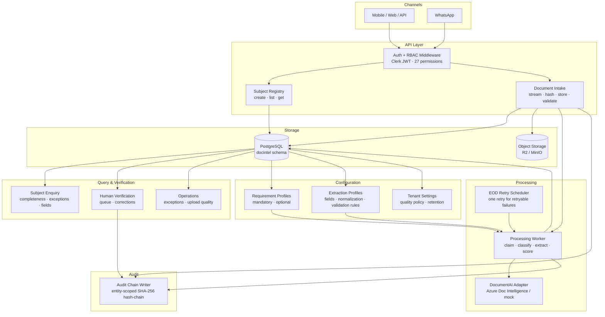
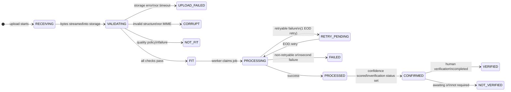

# Verigence Document Intelligence — Design Summary

**Baseline:** 2.2 | **Status:** BASELINED FOR IMPLEMENTATION | **Date:** 2026-08-11

> This is a 5-minute orientation document for any developer joining the project.
> It is derived from the authoritative design documents — do not edit this file directly.
> For normative detail, always go to the source documents listed in `DI_MASTER_REFERENCE.md`.

---

## What this system does

Verigence Document Intelligence is a **standalone service** that:

1. Accepts uploaded documents (images, PDFs) via REST API and WhatsApp (Phase 2)
2. Validates integrity and fitness (MIME, structure, quality rules)
3. Classifies the document type using OCR/AI
4. Extracts configured fields, normalizes and validates them deterministically
5. Scores confidence 0–100 per document
6. Derives whether human verification is OPTIONAL (score > 90) or MANDATORY (score ≤ 90)
7. Exposes Tenant + Subject centric REST enquiries

It owns its own **Subject Registry**. It does not depend on any external CRM or business system at runtime.

---

## Architecture — High Level



---

## Core document lifecycle



---

## Confidence and verification

```
confidence_score = weighted mean of field confidences (0–100, 2 decimals)

score > 90.00  →  humanVerificationStatus = OPTIONAL
score ≤ 90.00  →  humanVerificationStatus = MANDATORY

verificationState = NOT_VERIFIED | VERIFIED   (separate from the above)
```

Human verification is available only after machine CONFIRMED. Phase 1 allows **one** verification action per document. Machine confidence and facts are never overwritten.

---

## Field extraction model

This is the core of what the system does after a document is uploaded. Everything here is **database-driven configuration** — no code change is required to add a new field to a document type.

### Two separate "mandatory/optional" concepts

> These are different things — do not confuse them.

| Concept | What it means | Where configured |
|---|---|---|
| **Document-level MANDATORY / OPTIONAL** | Is this *type of document* required for a Subject? e.g. Passport = MANDATORY | `document_requirement_profile_items.requirement_classification` |
| **Field-level expected** | Is this *extracted field* expected to be present in the document? Absence reduces confidence. | `extraction_profile_fields.expected` + `score_included` + `score_weight` |

### How fields are configured — the chain

```
canonical_fields                       global or tenant-owned field definition
  └─ field_key, data_type, display_name  (STRING/DATE/DECIMAL/PHONE/etc.)
         │
extraction_profile_fields              per-profile, per-field configuration
  └─ enabled                           extract this field at all?
     expected                          is it expected to be present?
     score_included                    does it contribute to the confidence score?
     score_weight                      its weight in the confidence calculation
     manual_correction_allowed         can a human verifier correct this field?
     extraction_instruction            hint text sent to the AI provider
         │
profile_field_normalizers              ordered normalization rules applied to raw value
  └─ e.g. date → ISO 8601, phone → E.164, currency → decimal
         │
profile_field_validators               ordered validation rules applied after normalization
  └─ e.g. date not expired, ID checksum valid
     severity: INFO | WARNING | ERROR
```

A field that is `expected=true` but not found contributes `confidence=0` at its full `score_weight` — pulling the document's overall score toward the MANDATORY verification threshold (≤ 90.00).

### Where extracted values are stored

Three tables, each with a clear and separate purpose:

```
extracted_facts                        IMMUTABLE — one row per field per processing run
  ├── found_status                     FOUND | NOT_FOUND | AMBIGUOUS | ERROR
  ├── raw_value_text                   verbatim AI provider output
  ├── normalized_value                 after all normalization rules (JSONB)
  ├── confidence_score                 0–100 per field
  ├── page_no                          which page the field was found on
  └── evidence_region                  bounding box / coordinates (JSONB)

validation_results                     IMMUTABLE — one row per validation rule per field per run
  ├── result                           PASS | FAIL | WARNING | SKIP | ERROR
  ├── severity                         INFO | WARNING | ERROR
  └── message                          human-readable explanation

document_field_values                  VERSIONED — the current accepted value per field
  ├── current_value                    JSONB — what consumers should use
  ├── value_source                     MACHINE or HUMAN
  ├── is_current                       true for the one live value per field per document
  ├── version_no                       increments when a human corrects the field
  ├── source_extracted_fact_id         always links back to the machine extraction
  └── source_verification_id           set only when value_source = HUMAN
```

**Immutability rule:** machine facts and raw AI output are never overwritten. When a human corrector changes a field, a new `document_field_values` row is inserted (`value_source=HUMAN`) and the prior machine row is set `is_current=false`. Full lineage is always preserved.

### The API to get all extracted fields for a document

```
GET /v1/tenants/{tenantId}/subjects/{subjectId}/documents/{documentId}/fields
```

All API responses use the universal envelope:
```json
{ "errorCode": "000", "errorMessage": "Success", "data": { ... } }
```
Error codes: `000` = success, `E001`–`E010` = typed failures (see DI_DECISIONS.md D8).


Requires permission: `document:fields:read`

Returns `DocumentExtractionResult`:

| Response field | Description |
|---|---|
| `extractionProfileId` + `extractionProfileVersion` | Which profile version was used — full traceability |
| `confidenceScore` | Overall document confidence 0–100 |
| `humanVerificationStatus` | `OPTIONAL` (>90) or `MANDATORY` (≤90) |
| `verificationState` | `NOT_VERIFIED` or `VERIFIED` |
| `fields[]` | One `ExtractedField` per configured field |

Each `ExtractedField` in the array:

| Field | Description |
|---|---|
| `fieldKey` | Stable field identifier (from `canonical_fields`) |
| `displayName` | Human-readable label |
| `foundStatus` | `FOUND` / `NOT_FOUND` / `AMBIGUOUS` / `ERROR` |
| `rawValue` | Verbatim AI output |
| `normalizedValue` | After normalization rules |
| `machineConfidenceScore` | Per-field 0–100 |
| `currentAcceptedValue` | The value to use — machine or human-corrected |
| `currentValueSource` | `MACHINE` or `HUMAN` |
| `pageNo` + `evidenceRegion` | Where on the document the field was found |
| `humanCorrected` | `true` if a verifier changed this value |
| `sourceExtractedFactId` | Traceability link to the raw machine extraction |
| `sourceVerificationId` | Traceability link to the human verification if corrected |

For WhatsApp **unassigned** documents (not yet linked to a Subject):

```
GET /v1/tenants/{tenantId}/unassigned-documents/{documentId}/fields
```

Returns the identical `DocumentExtractionResult` structure.

---

## Data model — entity relationships

```
Tenant
 ├── Actors + Registered Devices
 ├── Subjects
 │    ├── Subject Identifiers  (deterministic matching)
 │    ├── Requirement Profile Assignment
 │    └── Documents
 │         ├── Artifacts  (ORIGINAL immutable + derived)
 │         ├── Quality Results  (one row per rule)
 │         ├── Processing Jobs → Runs → Provider Invocations
 │         ├── Classifications / Extracted Facts / Validation Results
 │         ├── Accepted Field Values  (MACHINE or HUMAN version)
 │         ├── Human Verification
 │         └── Optional Entity Links
 ├── Configuration
 │    ├── Document Types + Extraction Profiles
 │    ├── Requirement Profiles
 │    ├── Canonical Fields + Rule Catalogs
 │    └── Retention Policies + Quality Policy
 └── Audit Chain  (entity-scoped, SHA-256 hash-chained)
```

**Primary lookup key everywhere:** `tenant_id + subject_id`
There is no global `/documents/{id}` endpoint. All document access is scoped under a Tenant + Subject.

---

## Correlation lineage

One `X-Correlation-ID` traces the full chain:

```
HTTP request header X-Correlation-ID
  → documents.correlation_id
  → processing_jobs.correlation_id
  → processing_runs.correlation_id
  → processor_invocations.correlation_id
  → audit_events.correlation_id
  → structured log context
```

EOD retry creates a **new** correlation ID (new execution chain) but stays linked to the same Document history.

---

## Security model

```
JWT issued by Clerk (or any OIDC provider)
  ↓
Audience:  verigence-document-intelligence        (tenant tokens)
           verigence-document-intelligence-system (system/WhatsApp tokens)
  ↓
Required JWT claims:
  tenant_id · actor_id · actor_type · roles[] · permissions[]
  device_id  (USER actors only)
  ↓
Authorization checks permissions[] — never role name strings
```

### 8 role bundles (convenience — not enforced directly)

| Role | Key permissions |
|---|---|
| `DOCUMENT_OPERATOR` | subject:create, document:upload, document:read |
| `DOCUMENT_VERIFIER` | verification:read, verification:write |
| `OPERATIONS_VIEWER` | operations:read |
| `UNASSIGNED_INTAKE_OPERATOR` | unassigned_document:read/assign |
| `CONFIGURATION_ADMIN` | requirement_profile:*, extraction_config:*, quality_config:* |
| `TENANT_ADMIN` | all of the above + tenant_config:write |
| `SERVICE_INTEGRATION` | subject:create, document:upload, document:read |
| `PLATFORM_ADMIN` | platform:whatsapp:admin |

---

## API surface — 54 operations across 11 tag groups

| Tag group | Operations |
|---|---|
| Subjects | createSubject, listSubjects, getSubject |
| Subject Documents | uploadSubjectDocument, getSubjectDocuments, getSubjectDocument, **getSubjectDocumentTypes** (new), getSubjectDocumentContent, getSubjectDocumentFields, getSubjectDocumentExceptions, getSubjectDocumentQuality |
| Human Verification | verifySubjectDocument, getVerificationQueue |
| Operations | getTenantDocumentExceptions, getUploadQuality |
| External Links | getDocumentEntityLinks, addDocumentEntityLink |
| Requirement Profiles | listRequirementProfiles, createRequirementProfile, getRequirementProfile, updateDraftRequirementProfile, publishRequirementProfile, assignRequirementProfile |
| Extraction Config | listDocumentTypes, createDocumentType, getDocumentType, updateDocumentType, listExtractionProfiles, createExtractionProfile, getExtractionProfile, updateDraftExtractionProfile, publishExtractionProfile, listNormalizationRules, listValidationRules |
| Tenant Config | getTenantSettings, putTenantSettings, listRetentionPolicies, createRetentionPolicy, updateRetentionPolicy, getQualityPolicy, putQualityPolicy, listQualityRules |
| Subject Matching | addSubjectIdentifier, putWhatsappSenderMapping |
| WhatsApp (Tenant) | getUnassignedDocuments, getUnassignedDocument, getUnassignedDocumentContent, getUnassignedDocumentFields, getUnassignedDocumentQuality, assignDocumentSubject |
| WhatsApp (System) | putWhatsappRoute, whatsappWebhook, getWhatsappQuarantine, replayWhatsappQuarantine, discardWhatsappQuarantine |

---

## Technology stack

| Layer | Technology |
|---|---|
| Backend | Python 3.12 · FastAPI · SQLAlchemy (async) · Alembic · Pydantic v2 |
| Database | PostgreSQL 16 · `docintel` schema · Row-Level Security |
| Object storage | Cloudflare R2 (prod) · MinIO (local) · S3-compatible via aioboto3 |
| Auth | Security module (OIDC/JWT) — provider-neutral; only canonical JWT claims consumed |
| AI / OCR | Gemini 2.5 Flash (D19) · all documents scanned on upload (D18) · schema registry per doc type (D20) · mock in dev/CI |
| Scheduling | APScheduler (in-process, no external queue in Phase 1) |
| Operator UI | React 18 · TypeScript · Vite PWA · TanStack Query · Tailwind CSS |
| Hosting | Railway (API + Worker) · Cloudflare Pages (ops-ui) · Neon (PostgreSQL) |
| Observability | structlog (structured JSON) · Sentry · X-Correlation-ID |

---

## Deployment topology

```
                    ┌─────────────────────────────────┐
                    │           Railway                │
                    │  ┌──────────────┐  ┌──────────┐ │
Internet ──HTTPS──▶ │  │  FastAPI API  │  │  Worker  │ │
                    │  │  + Scheduler  │  │  Process │ │
                    │  └──────┬───────┘  └────┬─────┘ │
                    └─────────┼───────────────┼───────┘
                              │               │
                    ┌─────────▼───────────────▼───────┐
                    │         Neon PostgreSQL          │
                    │         docintel schema          │
                    └─────────────────────────────────┘
                              │
                    ┌─────────▼───────────────────────┐
                    │       Cloudflare R2              │
                    │  {tenant_slug}/subjects/...      │
                    └─────────────────────────────────┘

Cloudflare Pages ──▶  ops-ui React PWA
                      (Clerk auth · calls Railway API)
```

---

## WhatsApp flow summary

```
Meta Webhook (HMAC-verified, no JWT)
  ↓
Resolve Tenant from whatsapp_routes table
  ├── Route not found → system_intake_quarantine
  │                     (operator corrects route → replay)
  └── Route found → SYSTEM actor intake
                    subject_id = NULL (unassigned)
                      ↓
                    Normal processing pipeline
                      ↓
                    Operator assigns to Subject
                    (getUnassignedDocuments → assignDocumentSubject)
```

---

## Immutable design decisions (Baseline 2.2)

| Decision | Value |
|---|---|
| Confidence threshold for MANDATORY | score ≤ 90.00 |
| Verification threshold snapshot | always 90.00 (stored on document) |
| Max EOD retries | 1 (attempt_no 1 = INITIAL, attempt_no 2 = EOD_RETRY) |
| Audit chain key | `(tenant_id, entity_type, entity_id)` — entity-scoped |
| Job locking mechanism | `SELECT … FOR UPDATE SKIP LOCKED` |
| Authorization input | `permissions[]` in JWT — never role name strings |
| Primary lookup | `tenant_id + subject_id` — no global document endpoint |
| Classification candidate set | all ACTIVE types with PUBLISHED profiles; requirement profile is context only, never a filter |
| Caller hint (`documentTypeKey`) | persisted as `document_type_hint_key`; used as accepted classification (no AI classifier in Phase 1) |
| Original evidence | immutable from application perspective; content state → PURGED only via retention |
| Human correction | creates new HUMAN field value version; never overwrites machine facts or confidence |
| Phase 1 verification limit | one successful verification action per document |
| API response contract | universal envelope `{errorCode, errorMessage, data}` — `000` = success; branch on errorCode |
| source_channel | nullable — set by WhatsApp adapter only; not supplied by REST API callers |
| AI/OCR provider | Azure Document Intelligence (replaces Google Doc AI) — D13 |
| Scan all documents | Every document scanned by Azure DI on upload; no ADDITIONAL skip (D18) |
| ADDITIONAL model | `prebuilt-read` for ADDITIONAL + upi_screenshot doc types (D18) |
| New document types | `dealer_receipt` (prebuilt-invoice), `upi_screenshot` (prebuilt-read) — D16 |
| Cross-doc analysis | `POST /analyse` — R1–R7 reconciliation rules — D15 + D17 |

---

## Key design files (authoritative — do not edit this summary instead)

| What you need | File |
|---|---|
| Where to start every session | `DI_MASTER_REFERENCE.md` |
| Locked design decisions (read first) | `DI_DECISIONS.md` |
| Current implementation status | `PROGRESS.md` |
| Full architecture | `design/DI_ARCHITECTURE_v2.2.md` |
| Full component contracts | `design/DI_LLD_v2.2.md` |
| Database schema (DDL) | `design/DI_POSTGRESQL_SCHEMA_v2.2.sql` |
| All API operations | `design/DI_OPENAPI_v2.2.yaml` |
| JWT claims + 27 permissions | `design/DI_SECURITY_RBAC_v2.2.md` + `design/DI_RBAC_v2.2.yaml` |
| Error codes | `design/DI_ERROR_CATALOG_v2.2.md` + `design/DI_ERROR_CATALOG_v2.2.yaml` |
| Classification algorithm | `design/DI_CLASSIFICATION_v2.2.md` |
| Audit chain model | `design/DI_AUDIT_MODEL_v2.2.md` |
| Data model | `design/DI_DATA_MODEL_v2.2.md` |
| Env vars / secrets | `SECRETS_CHECKLIST.md` |
